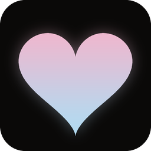
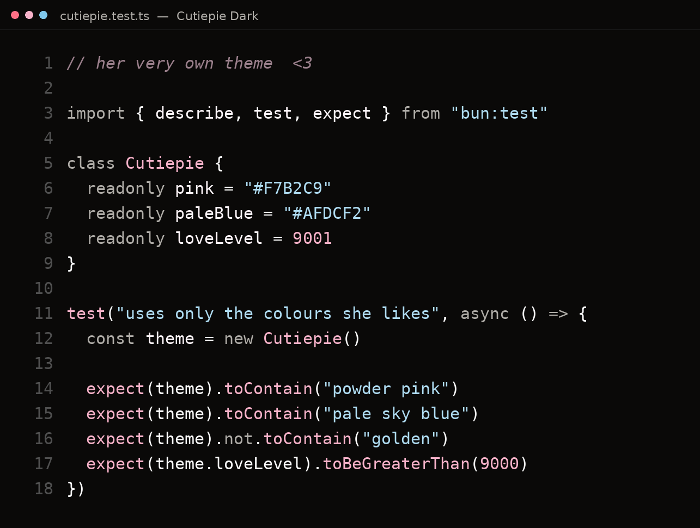
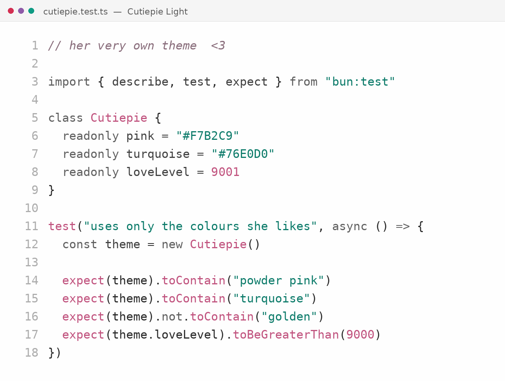
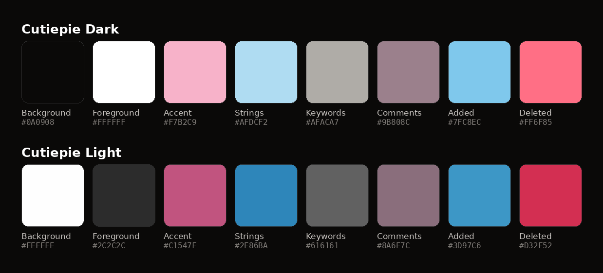

<div align="center">



# Cutiepie

**A soft VS Code theme in powder pink and turquoise on true black.**

Two accents and nothing else. Pink carries structure — functions, classes, tags, keys.
Turquoise carries content — strings. Everything else is greyscale.

[](LICENSE)

</div>

---

### Cutiepie Dark



### Cutiepie Light



---

## Install

Search **Cutiepie** in the Extensions panel, or:

```
ext install adityasasidhar.cutiepie
```

Then <kbd>Ctrl</kbd>+<kbd>K</kbd> <kbd>Ctrl</kbd>+<kbd>T</kbd> → **Cutiepie Dark** or **Cutiepie Light**.

<details>
<summary>Install from source</summary>

```bash
git clone https://github.com/adityasasidhar/cutiepie.git
cd cutiepie
npm install && npx vsce package
code --install-extension cutiepie-1.0.0.vsix
```

</details>

## Palette



| Role | Dark | Light |
| --- | --- | --- |
| Background | `#0A0908` | `#FEFEFE` |
| Foreground | `#FFFFFF` | `#2C2C2C` |
| **Accent** — functions, classes, tags, JSON keys, cursor, buttons | `#F7B2C9` | `#C1547F` |
| **Strings** — strings, interfaces, readonly props | `#76E0D0` | `#0E7C6B` |
| Keywords, operators, parameters | `#AFACA7` | `#616161` |
| Comments *(italic)* | `#9B808C` | `#8A6E7C` |
| Added | `#4FC9B0` | `#0F9B84` |
| Deleted / error | `#FF6F85` | `#D32F52` |
| Merge conflict | `#C9A0DC` | `#8E5AA8` |

Three choices worth explaining:

- **Git and diff green is turquoise.** In a two-accent palette turquoise already reads as
  "good" — a separate green only added a third hue.
- **Errors stay red, but rosy.** Deliberately more saturated than the accent, so an error
  never reads as decoration.
- **Merge conflicts are lavender.** With the warm tones gone, orange had nowhere to sit.

## Development

The JSON in `themes/` is the source of truth. Everything in `assets/` is generated from it,
so the screenshots can't drift from what ships:

```bash
python3 scripts/render_previews.py     # assets/preview-{dark,light}.png
python3 scripts/render_palette.py      # assets/palette.png
```

## Credits

Built on [**Vesper**](https://github.com/raunofreiberg/vesper) by
[Rauno Freiberg](https://github.com/raunofreiberg). The scope structure and token
architecture are his; this theme is a recolour of that groundwork. Thank you.

## License

MIT © 2026 Aditya Sasidhar. Portions derived from Vesper, MIT © 2023 Rauno Freiberg —
see [LICENSE](LICENSE) for both notices.
